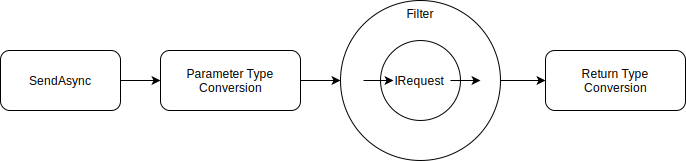

# ServiceLikeの使い方

ServiceLikeは、[MediatR]のハンドラを文字列で指定して実行できるようにします。
そうすることで`IRequest`および`INotification`の実装自体への依存も無くせます。
これは、例えば別のアセンブリで定義された`IRequest`の呼び出しを行いたいが、アセンブリ参照はさせたくない場合などに便利です。

## IRequestをサービスのように利用する

パスを設定してサービスのように公開するには`IRequest`に`AsServiceAttribute`属性を設定します。

```cs
[AsService("/basic")]
public class BasicRequest: IRequest<BasicResult>
{
    public string Id { get; set; }
}
```

`AsServiceAttribute`属性は一つの`IRequest`の実装に対して複数設定して、複数のパスを指定できます。

この型の`Type`を`RequestRegistry`のインスタンスに追加することで、設定内容が検証され、パスで呼び出しできるようにオブジェクトが構築されます。

```cs
requestRegistry.Add(typeof(BasicRequest));
```

ただし、`RequestRegistry`への登録などはDIコンテナ等を通じて隠ぺいされるため、通常は実装する必要はありません。

### リクエストの実行

リクエストを実行するには、`DefaultMediatorClient`のインスタンスを利用します。

```cs
var client = new DefaultMediatorClient(requestRegistry, notificationRegistry, serviceFactory, scopedServiceFactoryFactory, logger);
var result = await client.SendAsync<Output>("/basic", new { Id = "345" });
```

この`DefaultMediatorClient`のインスタンスの構築も、通常はDIコンテナを通じて行われるため、実装する必要はありません。

#### 引数と戻り値の型

`DefaultMediatorClient`の`SendAsync`に渡す引数と戻り値の値は、実際の`IRequest`で定義されている型である必要はありません。内部で`System.Text.Json`を利用して、次のような操作が行われているため同等の構造であれば多くの値が変換できます。

- 引数の場合
  - 引数の値をシリアライズしてJSON文字列を作成する
  - JSON文字列をIRequestにデシリアライズする
- 戻り値の場合
  - 戻り値の値をシリアライズしてJSON文字列を作成する
  - JSON文字列をジェネリックで指定された型にデシリアライズする

ただし、引数と戻り値ともに`null`または`MediatR.Unit`型の場合は`null`に変換されます。

### フィルター

`DefaultMediatorClient`の`SendAsync`が実行され、引数の型が変換されてから`MediatR`の`IRequest`が実行されるまでの間で`IMediatorServiceFilter`を実装した独自の処理を挟み込めます。

`IMediatorServiceFilter`はオニオン構造で実行されるため、`IRequest`の実行前後で処理を行えます。また`IRequest`を実行せず、処理を中断することも可能です。



#### フィルターの実装

フィルターは`IMediatorServiceFilter`を継承して、`HandleAsync`メソッドを実装します。`HandleAsync`にはリクエスト情報と`IRequest`に渡されるパラメーターの値、次に実行するフィルターもしくは`IRequest`呼び出しのデリゲートが渡されます。戻り値で返した値が`IRequest`呼び出しの結果として`DefaultMediatorClient`に渡されます。

```cs
public class ExceptionFilter : IMediatorServiceFilter
{
    public async Task<object> HandleAsync(RequestContext context, object parameter, Func<object, Task<object>> next)
    {
        try
        {
            return await next(parameter);
        }
        catch(Exception ex)
        {
            var logger = context.ServiceFactory.GetInstance<ILogger<ExceptionFilter>>();
            logger.LogError(ex, "Error");
            throw ex;
        }
    }
}
```

#### フィルターの設定と実行順序

実行するフィルターは次の箇所で`Type`を指定します。

1. `RequestRegistry`の`Add`メソッド
2. `AsServiceAttibute`の`filterTypes`パラメーター

実行される順序も、上記の並びで実行されます。
次のコード例では`Filter1`、`Filter2`、`Filter3`、`Filter4`の順番となります。

```cs
[AsService("/sample", typeof(Filter3), typeof(Filter4))]
public class SampleRequest: IRequest<SampleResult>
{
    public string Id { get; set; }
}

requestRegistry.Add(typeof(SampleRequest), typeof(Filter1), typeof(Filter2));
```

## INotificationをイベントのように利用する

キーを設定してイベントのように公開するには`INotification`に`AsEventListenerAttribute`属性を設定します。

```cs
[AsEventListener("basic")]
public class BasicNotification: INotification
{
    public string Id { get; set; }
}
```

`AsEventListenerAttribute`属性は一つの`INotification`の実装に対して複数指定できます。

```cs
[AsEventListener("basic")]
[AsEventListener("other")]
public class BasicNotification: INotification
{
    public string Id { get; set; }
}
```

この型の`Type`を`NotificationRegistry`のインスタンスに追加することで、設定内容が検証され、キーで呼び出しできるようにオブジェクトが構築されます。

```cs
notificationRegistry.Add(typeof(BasicNotification));
```

ただし、`NotificationRegistry`への登録などはDIコンテナ等を通じて隠ぺいされるため、通常は実装する必要はありません。

### 通知の実行

通知を実行するには、`DefaultMediatorClient`のインスタンスを利用します。

```cs
var client = new DefaultMediatorClient(requestRegistry, notificationRegistry, serviceFactory, scopedServiceFactoryFactory, logger);
await client.PublishAsync("basic", new { Id = "345" });
```

`PublishAsync`は非同期で待ち合わせを行わず`INotificationHandler`を実行します。
そのため`PublishAsync`メソッドが完了しても、`INotificationHandler`は完了していない可能性があります。

`DefaultMediatorClient`のインスタンスの構築も、通常はDIコンテナを通じて行われるため、実装する必要はありません。

#### 引数の型

`DefaultMediatorClient`の`PublishAsync`に渡す引数の値は、実際の`INotification`で定義されている型である必要はありません。内部で`System.Text.Json`を利用して、次のような操作が行われているため同等の構造であれば多くの値が変換できます。

- 引数の値をシリアライズしてJSON文字列を作成する
- JSON文字列をIRequestにデシリアライズする

ただし、引数と戻り値ともに`null`または`MediatR.Unit`型の場合は`null`に変換されます。

#### ServiceFactoryのスコープ

複数の`INotification`で同じイベント名が設定されている場合は、別のスコープの`ServiceFactory`が利用されます。ただし、同じ`INotification`が指定されているハンドラが複数ある場合は、それらのハンドラでは同じスコープが利用されます。

[MediatR]:https://github.com/jbogard/MediatR